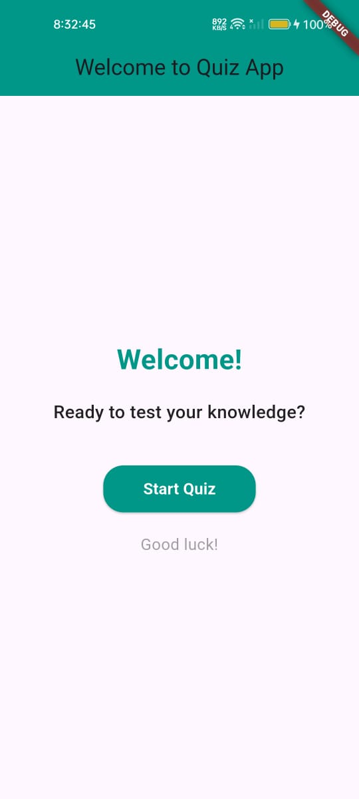
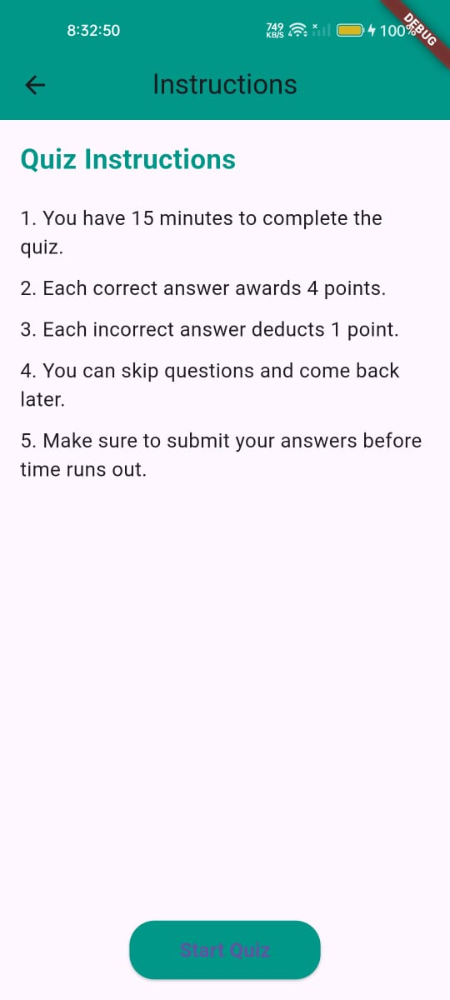
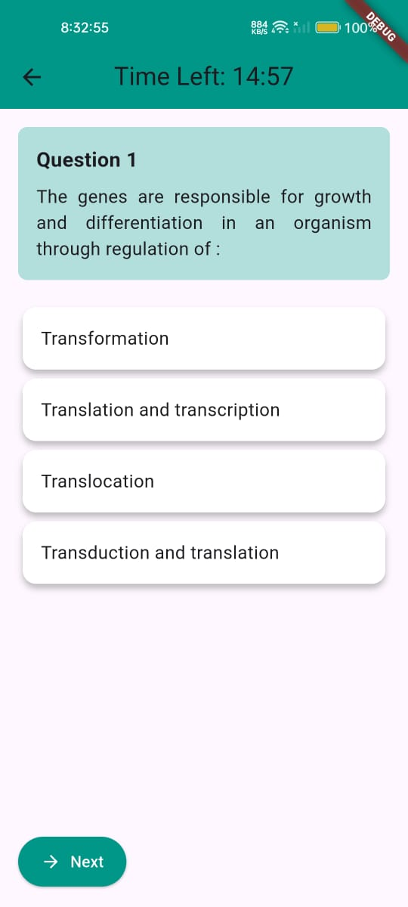
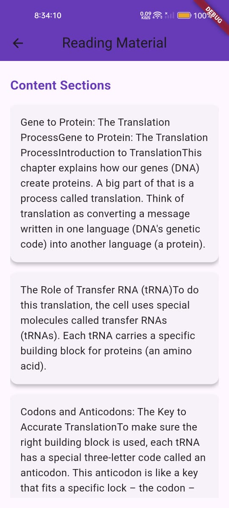
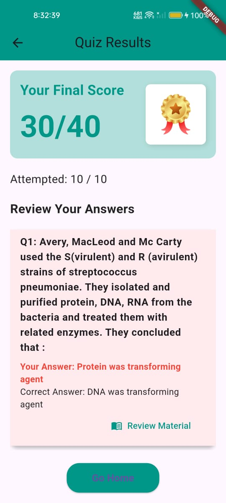

# Quiz App - README

## Project Overview

The **Quiz App** is a mobile application built with **Flutter** that allows users to take a quiz, track their scores, and review answers. The app supports features like:

- **Timed Quiz**: The user has a set time to answer each question.
- **Score Calculation**: Correct answers award points, while incorrect answers deduct points.
- **Shuffle Questions & Answers**: The questions and their options can be shuffled for varied quiz experiences.
- **Badges & Score Display**: The app assigns badges based on the user’s score (Bronze, Silver, Gold) and displays their total score.
- **Answer Review**: Users can review answers after completing the quiz along with learning material if needed.

The app's main goal is to provide an interactive and informative quiz-taking experience.

---

## Features

- **Dynamic Quiz Loading**: Fetches quiz data from a backend API and displays it to the user.
- **Timer**: A countdown timer is shown to the user during the quiz.
- **Quiz Review**: After completing the quiz, users can review their answers.
- **Badges**: Badges are awarded based on the final score, with different badge thresholds (Gold, Silver, Bronze).
- **Answer Feedback**: Shows whether the user's selected answer was correct or not.
- **Reading Material**: If a user answers incorrectly, they can access reading material related to the question.

---

## Setup Instructions

### Prerequisites

Make sure you have the following installed on your machine:

1. **Flutter**: Follow the installation guide here: [Flutter Installation](https://flutter.dev/docs/get-started/install)
2. **Dart SDK**: Flutter comes bundled with Dart.
3. **Android Studio** or **VS Code**: For Flutter development, you can use either Android Studio or Visual Studio Code.
4. **Java JDK**: Ensure you have the Java JDK installed. For Java 21, make sure your Gradle version is updated to at least 8.2.1 to avoid compatibility issues.

### Steps to Run the Project

1. **Clone the repository**:
   ```bash
   git clone https://github.com/saicharan1342/quiz.git
   cd quizz
   ```

2. **Install dependencies**:
   Run the following command to install the required dependencies:
   ```bash
   flutter pub get
   ```

3. **Run the project**:
   Ensure your device or emulator is running, and execute the following command:
   ```bash
   flutter run
   ```

4. **Platform-specific setup**:
   - **Android**: Make sure Android Studio or your preferred IDE is set up with the required SDKs.
   - **iOS**: Make sure Xcode is installed and set up on macOS for iOS builds.

---

## Screenshots

Here are some screenshots showing the UI and quiz in action:

1. **Home Screen**:
   - Displays the welcome message and the "Start Quiz" button.

   

2. **Instructions Screen**:
   - Displays the instructions before starting the quiz.

   

3. **Quiz Screen**:
   - The quiz page where users answer questions with a timer counting down.

   

4. **Reading Material Screen**:
   - Displays the reading material and practice questions.

   

5. **Result Screen**:
   - After completing the quiz, users can view their score, badges, and the review of their answers.

   

---

## Video Walkthrough

Here is a short video walkthrough of the app, demonstrating the features:

[Video Walkthrough Link](https://drive.google.com/file/d/1CerGM5wpDdloXKl_SrVgBIXe-m6FNO89/view?usp=drivesdk)

---

## Future Enhancements

- **User Authentication**: Allow users to log in and save their scores.
- **Leaderboard**: Add a leaderboard feature to display top scores.
- **Offline Mode**: Allow quizzes to be taken offline with pre-downloaded questions.

---

## License

This project is licensed under the MIT License - see the [LICENSE](LICENSE) file for details.

---

## Acknowledgements

- **Flutter**: The app is built using the Flutter framework.
- **Dart**: The app logic is implemented in Dart.
- **Icons**: Icons are sourced from the Material Icons library.

---

Feel free to contribute or suggest improvements to the project!